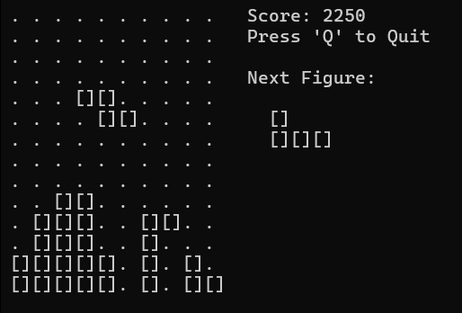

# TetrisCLI

Простая реализация классической игры Tetris в командной строке на Python с использованием `curses`.



## Особенности

- Классический игровой процесс Tetris
- Динамическое ускорение при прохождении линий
- Предпросмотр следующей фигуры
- Отслеживание очков и количества очищенных строк
- Конфигурируемые параметры через YAML
- Автоматическое создание конфига при первом запуске

## Требования

- Python 3.11+
- Windows/Linux/macOS

## Установка

### Через `uv` (рекомендуется)

```bash
cd TetrisCLI
uv sync
```

### Через `pip`

```bash
cd TetrisCLI
pip install -e .
```

## Запуск

```bash
uv run src/testris.py
```

или (для pip)

```bash
python src/testris.py
```

## Управление

| Клавиша | Действие |
|---------|----------|
| `←` / `→` | Движение влево/вправо |
| `↓` | Медленное падение |
| `SPACE` | Жёсткое падение (hard drop) |
| `↑` | Поворот фигуры |
| `Q` | Выход из игры |

## Конфигурация

Параметры игры хранятся в `config.yaml`:

```yaml
WIDTH: 10                      # Ширина игрового поля
HEIGHT: 14                     # Высота игрового поля
SPEED_INCREASE_THRESHOLD: 8    # Линии для ускорения
```

При первом запуске конфиг автоматически создаётся с дефолтными значениями.


## Структура проекта

```
TetrisCLI/
├── config.yaml           # Конфигурация игры
├── pyproject.toml        # Зависимости и метаданные
├── README.md             # Этот файл
└── src/
    ├── __init__.py
    ├── config.py         # Загрузка конфигурации
    ├── board.py          # Логика игрового поля
    ├── figure.py         # Тетромино (геометрия фигур)
    ├── testris.py        # Главная игровая логика
    └── main.py           # Старая версия (архив)
```

## Игровая механика

### Фигуры 

Доступны все 7 стандартных тетромино:
- **I** — прямая
- **O** — квадрат
- **T** — Т-образная
- **S** — S-образная
- **Z** — Z-образная
- **J** — J-образная
- **L** — L-образная

### Очки

- **Падение вниз** (автоматическое): +5 очков
- **Очищенная строка**: +500 очков

### Усложнение

При каждых 8 очищенных строк скорость падения увеличивается (минимум 0.05 сек/блок).
